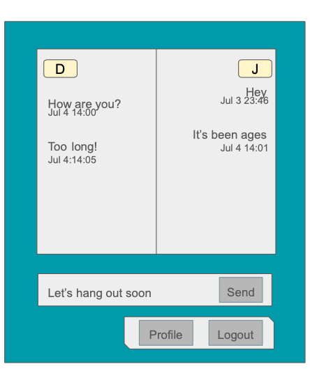
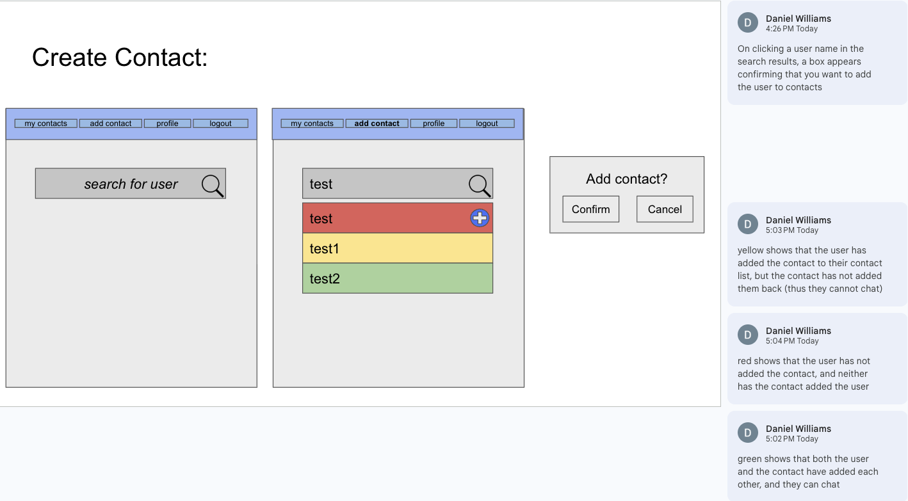

# Page Testing


# 1) Login/Registration Page

### Description:


### Parameters/Data:
- JSON from Flask notifying the browser if the provided username is available for registration
- JSON from Flask notifying the browser if the provided credentials are valid

### Link Destinations:
- Login Page after successful registration
- Contacts Page upon succesful login

### Tests:
- Confirm that incorrect login credentials are rejected
- Confirm that valid registration credentials can be used to login
- Confirm that correct login credentials result in a redirect to the Contacts page

# 2) Contact List

# 3) Chat
### Page title
Chat

### Page description
- A chat room between two users. 
- Provides a split screen view of the chat log with one user's messages on one side of the screen and the other user's messages on the other. Each side has an indicator at the top of which user is on which side (user initials). Messages include a time stamp and are ordered.
- Below the chat log are two additional areas: an area to type and send new messages, and a menu bar with buttons to other linked pages.



### Parameters needed for the page
- userIds of each of the two users in the chat

### Data needed to render the page
- Usernames of the two users (for the split screen indicator)
- Message history between the two users including message content and timestamp of each message (for the chat log)

### Link destinations for the page
- This page is linked to two others: the 'Profile' page and the 'Logout' page.

### List of tests verifying the rendering of the page
*Basic page rendering*
- page loads with empty chat log (no history between users)
- page loads with full chat log (long history between users)

*UI tests*
- new messages can be sent by self-user
- new messages appear in the chat log after self-user sending
- new messages appear in the chat log after other-user sending
- can follow link to profile page
- can follow link to logout page

# 4) Profile

# 5) Create Contact
### Page title
Add Contact

### Page description
Page where users can search for a user by username so that they can add them to their contact list.



### Parameters needed for the page
```search``` is an optional query parameter, which is the username being searched for.

### Data needed to render the page
- List of users that match the search query
- Current user information (to exclude from the results)
- Existing contacts (to show if someone is already a contact)

### Link destinations for the page
- A link to 'add contacts' will appear on every page on the nav bar.
- An icon for adding contacts will appear on the 'contacts' page.

### List of tests verifying the rendering of the page
*Basic page rendering*
- only logged in users can view the page. Anonymous users should be redirected to login page.
- page loads successfully with correct title and main elements
- search form has correct input field and search button
- nav bar displays with "add contact" in bold/highlighted

*Search functionality rendering*
- empty search shows appropriate message (e.g. "search for a user")
- no results found displays helpful message (e.g. ("No users found matching 'xyz'")
- search results display correctly: username and add button if applicable

*UI tests*
- add button disappears after contact has been added
- error messages display properly (e.g. "Failed to add contact - please try again")

*Edge cases*
- long usernames display properly (truncation or wrapping)
- large number of search results doesn't break layout

*Integration with existing data*
- existing contacts indicated (e.g. with color)
- logged-in user is excluded from search results
- contact status updates immediately after adding (no page refresh needed)
