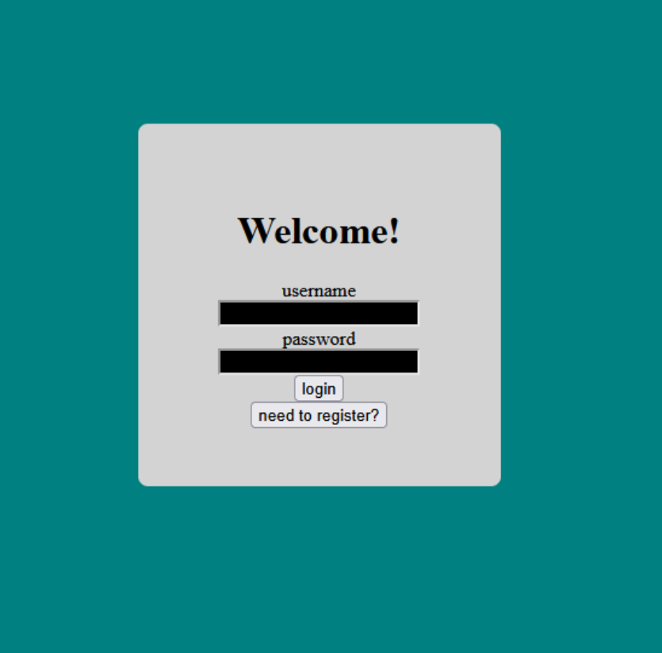
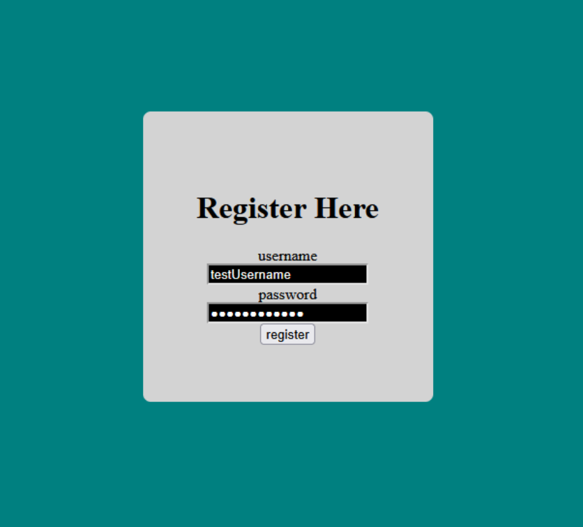

# Page Testing

# 1) Login/Registration Page

### Description:

### Parameters/Data:
- JSON from Flask notifying the browser if the provided username is available for registration
- JSON from Flask notifying the browser if the provided credentials are valid

### Link Destinations:
- Login Page after successful registration
- Contacts Page upon succesful login

### Tests:
- Confirm that incorrect login credentials are rejected
- Confirm that valid registration credentials can be used to login
- Confirm that correct login credentials result in a redirect to the Contacts page

# 2) Contact List

# 3) Chat

# 4) Profile

# 5) Create Contact
