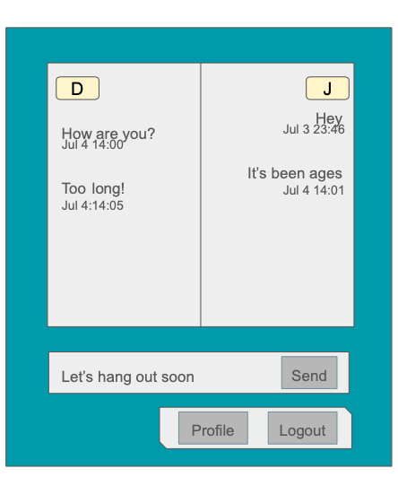

Page Title: 
- Chat

Page Description: 
- A chat room between two users. 
- Provides a split screen view of the chat log with one user's messages on one side of the screen and the other user's messages on the other. Each side has an indicator at the top of which user is on which side (user initials). Messages include a time stamp and are ordered.
- Below the chat log are two additional areas: an area to type and send new messages, and a menu bar with buttons to other linked pages.

Parameters needed for the page: 
- userIds of each of the two users in the chat

Data needed to render the page: 
- Usernames of the two users (for the split screen indicator)
- Message history between the two users including message content and timestamp of each message (for the chat log)

Link destinations for the page: 
- This page is linked to two others: the 'Profile' page and the 'Logout' page.

List of tests for verifying the rendering of the page
- page loads with empty chat log (no history between users)
- page loads with full chat log (long history between users)
- new messages can be sent by self-user
- new messages appear in the chat log after self-user sending
- new messages appear in the chat log after other-user sending
- can follow link to profile page
- can follow link to logout page