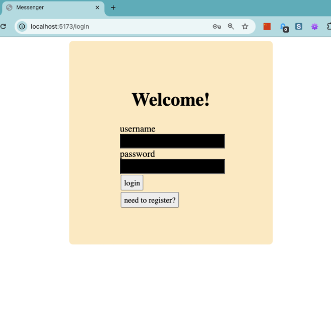

# CSPB-3308-Team-6

Project Title: Messenger App

Team #: Team 6

Team/Product Name: Undefined

Team members: list the name, git username, and email for each member.
   *   Sara Rhoades, smrhoades, srhoades@colorado.edu
   *   Joey Musholt, joeymu, jomu7038@colorado.edu
   *   Joel Henry,  joelthenry email: joelthenry@gmail.com
   *   Daniel Williams, dan-willia dawi2291@colorado.edu
   
Vision statement: Connect through messaging

Motivation:
- Create a means of exchanging messages between users
- Collaborating to learn new tools and processes ( HTML, Javascript, Python, SQL, network traffic )
- Simple MVP with flexibility to add incremental features

Tools Used:
- Project tracker: Jira
- Version control: Gitlab
- Database: Supabase
- Testing: pytest
- Deployment environment: local or coding.csel.io
- Programming languages and frameworks:
   - backend: python, flask, socketio, react
   - frontend: css, jsx, html
   - database: sqlalchemy

## Sub Reports

- [Link to Page Testing](../PAGE_TESTING/PAGE_TESTING.md)
- [Link to Database Design](../SQL_TESTING/SQL_TESTING.md)
- [Link to Test Architecture Design](../TEST/CSPB3308_TestArchitecture.pdf)
- [Link to Story Development](../STORIES/Messaging_App_User_Stories.md)
- [Link to Weekly Status](../WEEKLY_STATUS/WEEKLY_STATUS.md)

## Final Status Report and Reflection

What you completed
- Login page
  - Backend
    - The login page accepts a username and password, and checks that both exist in the database and match to the same entry. If authorized, the user is logged in else it returns an appropriate error message.
  - Front End
    - The login page provides a place for a user to input a username and password. A button allows the submission of the data.
  

- Register page
  - Backend
    - The registration page accepts a username and password, and checks against a database of registered users and adds to the database if the username is not taken. If the username is already taken, it returns an appropriate error message.
  - Front End
    - The registration page provides a place for a user to input a username and password. A button allows the submission of the data.
    

- Profile page
  - Backend
    - Allows for the user to view their own name and log out of the app
  - Front End
    - Displays your username, has links to other pages, and has a sign out option 
    

- Chat page (1-on-1 chats)
  - Backend
    - The chat page retrieves a message history, adds to that history, and immediately displays the new messages to both users.
  - Front End
    - The chat page shows the chat history between two selected users and allows for new messages to be sent with a text input area and a submission button.
    

- Contacts page
  - Backend
    - The contacts page gets a list from the database which include the current user as one half of a contact pair. For these contact pairs, the three most recent messages are then retrieved as well.
  - Front End
    - The contacts page provides a list of other users whom the current user has added as a contact. Each contact may be selected to go to a chat page with that user.
    

What you were in the middle of implementing
- Database: Connect to real external database (Supabase)
- Backend: Username validation and password requirements for registration page
- Backend: Ability to change (i.e. update or reset) user password for registered users
- Backend: Additional error handling of common and expected problems
- Frontend: Display most recent messages on contacts page
- Frontend: Display area for error messages returned to the user

What you had planned for the future
- Group (multi-user) chats
- Encryption

Any known problems (bugs, issues)
- App does not work in coding.csel.io environment with the addition of React due to the proxy

## Links

Project tracker link:
https://undefined6.atlassian.net/jira/core/projects/MA/board?groupBy=status

Version control repository link:
https://github.com/smrhoades/CSPB-3308-Team-6

Demo Video Link: 
a demo for a potential customer (could be same one you used in the presentation)

Public hosting site link:
List your public hosting site and make sure that it is available
