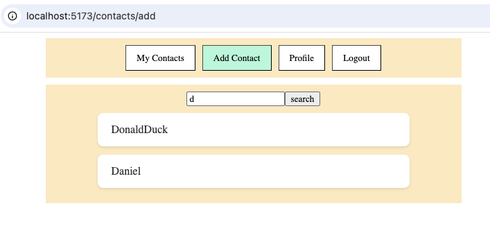

# CSPB-3308-Team-6

Project Title: Messenger App

Team #: Team 6

Team/Product Name: Undefined

Team members: list the name, git username, and email for each member.
   *   Sara Rhoades, smrhoades, srhoades@colorado.edu
   *   Joey Musholt, joeymu, jomu7038@colorado.edu
   *   Joel Henry,  joelthenry email: joelthenry@gmail.com
   *   Daniel Williams, dan-willia dawi2291@colorado.edu
   
Vision statement: Connect through messaging

Motivation:
- Create a means of exchanging messages between users
- Collaborating to learn new tools and processes ( HTML, Javascript, Python, SQL, network traffic )
- Simple MVP with flexibility to add incremental features

## Final Status Report and Reflection

What you completed
- Front End
  - Login page
  

  - Register page
    

  - Profile page
    

  - Chat page (1-on-1 chats)
    

  - Contacts page
    

- Backend
  - Chat

What you were in the middle of implementing
- Connect to real database (Supabase)

What you had planned for the future
- Group chats

Any known problems (bugs, issues)
- App does not work in coding.csel.io environment

## Links

Project tracker link:
https://undefined6.atlassian.net/jira/core/projects/MA/board?groupBy=status

Version control repository link:
https://github.com/smrhoades/CSPB-3308-Team-6

Demo Video Link: 
a demo for a potential customer (could be same one you used in the presentation)

Public hosting site link:
List your public hosting site and make sure that it is available
