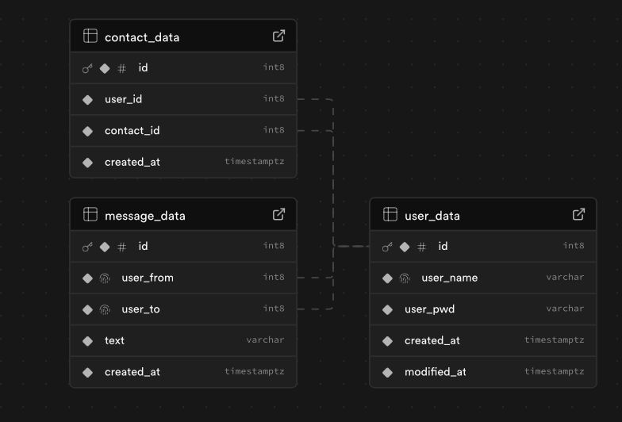

# SQL Design

# 1) Message Data

### Table Name
message_data

### Table Description
This table contains data of messages being sent between individual users. It contains the Ids of the two users, the text of the message, and a timestamp of when the message was sent.

### Table Parameters
id: (table index) auto-incrimenting id of the message
user_from: (foreign key) the id of the user who sent the message
user_to: (foreign key) the id of the user who recieved the message
text: variable length content of the message
created_at: timestamp of when the message was sent

### List of tests for verifying each table
- table can be created
- entry can be added to the table
- entry cannot be added unless all fields have values (non-null)
- entry cannot be added unless both users exist in the user_data table

### Data Access Methods

#### Name
getMessageHistory

#### Description
Get ordered list of messages previously sent between two users

#### Parameters
user1: id of one user
user2: id of a different user

#### return values
textArray: list of messages in order from oldest to newest
timestampArray: list of timestamps cooresponding to the messages

#### List of tests for verifying each access method
- arrays are returned with entries if two users have messages sent between them
- messages are returned for both sides of the conversation (user1->user2 AND user2->user1)
- timestampArray entries are ordered from oldest to newest regardless of message direction
- textArray entries are correctly ordered and coorespond to timestampArray entries
- empty arrays are returned if two users have no messages sent between them
- empty arrays are returned if either of the users does not exist in the user_data table

# 2) User Data

### Table Name
user_data

### Table Description
This table contains info related to registered users of the website. 

### Table Parameters
id: Primary Key Integer
user_name: Unique String 
user_pwd: string
created_at: timestamp with timezone
modified_at: timestamp with timezone

### List of tests for verifying each table
- table can be created
- entries can be CRUD'd to/from the table
- created_at updated automatically with default value of "now"
- when user_name or user_pwd is updated, the modified_at field is updated to "now", and created_at is not updated

### Data Access Methods

#### Name
getUser

#### Description
returns the User record corresponding to the argument passed

#### Parameters
user_param: can be either an Int corresponding to User's ID or a Str corresponding to user's user_name

#### return values
User record

#### List of tests for verifying each access method
- returns correct record when User ID passed
- returns correct record when User user_name is passed
- returns None when an Int or Str is passed that does not correspond to any id or user_name in the table
- throws exception when Int or Str is not passed

# 3) Contact Data

### Table Name
contact_data

### Table Description
This table contains information on which users have been added to each user's contacts list as well as the time of contact creation.

### Table Parameters
id: table index

user_id: unique identifier for users

contact_id: unique identifier for users (for each contact OF associated user_id)

created_at: timestamp for creation of contact

### List of tests for verifying each table
- table can be created

- new valid row may be added to table (must have valid and full contents and not already exist as contact)

### Data Access Methods

#### Name
getContactsList

#### Description
Query the database and return list of user's contacts and timestamps

#### Parameters
user: id of user seeking contacts list

#### return values
contactsArray: list of contacts in order from older to newest

timestampArray: list of timestamps corresponding to contact creation

#### List of tests for verifying each access method
- all contacts for user are returned

- no contacts for other users are returned

- both return arrays are in correct order

- both return arrays are of the same length
