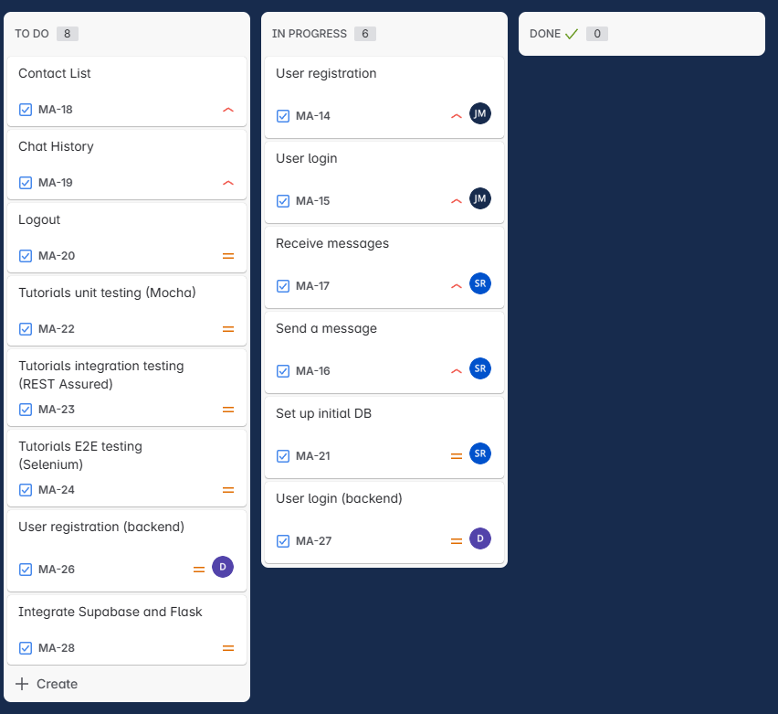

Weekly Status Report

What we've done this week
- added additional items to Jira
- sent and received json requests between Flask & React
- Accessed and configured SupaBase as the app's database

What we're working on
- getting project working outside of CSEL environment
- mock up of each page of the site
- handling responses from the server to requests sent from the front-end

