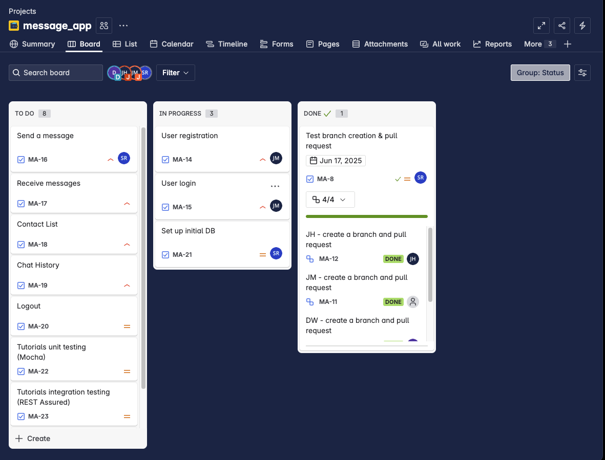

Weekly Status Report

What we've done this week
- created READMEs for testing, Flask messaging prototype
- added initial user stories to Jira
- created database structure for users and messages
- created dummy user login and registration page

What we're working on
- get rest of team added to Supabase
- integrate front end (React) with backend (Flask) and database (Supabase)
- create test data for database
- implementing more user stories
- tutorials for testing frameworks

