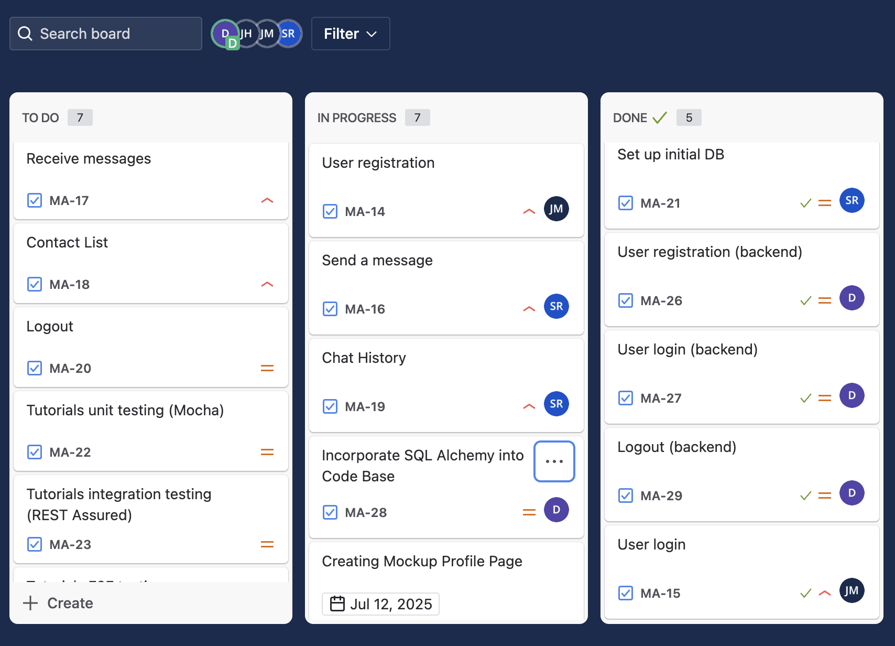

Weekly Status for Week 8

What we've done this week
- completed user login for front and backend
- completed user registration for backend
- created contacts-list page on front end
- created conversation-page on front end
- created and discussed mockups for web page design
- decided to incorporate SQLAlchemy as ORM for database interactions
- continued testing with WebSockets for chat interactions

What we're working on
- writing code to incorporate SQLAlchemy into code base
- continue working on send message user story
- Project Milestone 4: web pages design
- chat history user story

